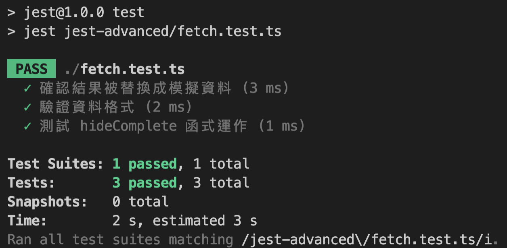
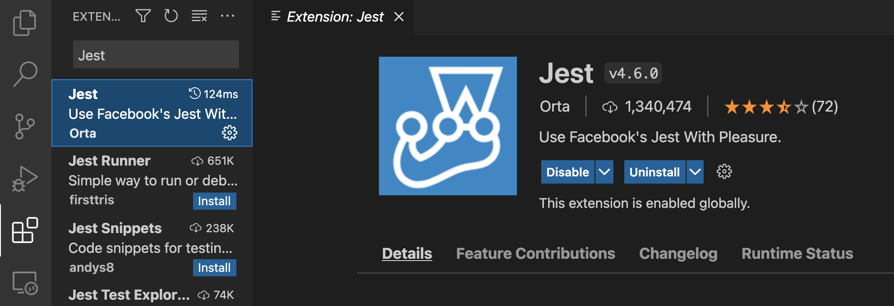
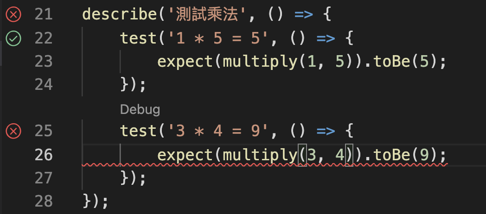
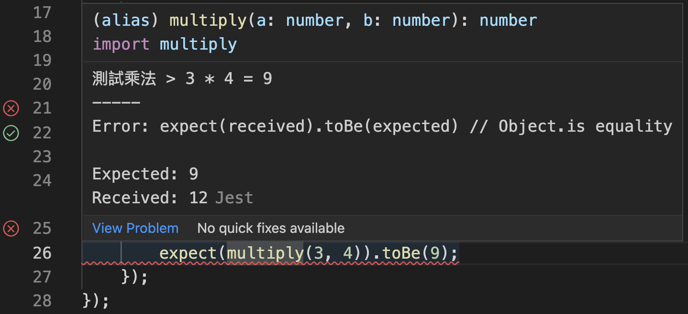

# Jest 框架進階應用（describe、Setup and Teardown、Mock function）

> 如果你對 Jest 這個測試框架還一無所知，建議先看[上一篇文章](../jest-basic/README.md)喔！

一個功能底下可能有很多函式，如果測試程式沒有適當的區分，那在遇到錯誤時會難以管理，因此我們要對它進行分組（describe）；當我們想測試特定情境時，可以在測試前增加資料（Setup）並於測試後移除（Teardown）；為了讓單元測試更存粹，可以透過模擬函式（Mock function）減少相依性。

```
大綱

一、測試分組（describe）
二、在測試前、後要執行的任務（Setup and Teardown）
三、用 Mock Function 減少測試時的相依性
四、VSCode 的 Jest 外掛
```

### 一、測試分組（describe）

比如今天我們設計一個計算機，裏面包含「加減乘除」等功能，如果要針對不同 function 做分組測試，我們可以這樣做：

- **calculator.ts**：計算機基礎功能（加減乘除）。

```ts
export function sum(a: number, b: number) {
  return a + b;
}
export function minus(a: number, b: number) {
  return a - b;
}
export function multiply(a: number, b: number) {
  return a * b;
}
export function divide(a: number, b: number) {
  return a / b;
}
```

- **calculator.test.ts**：分組測試計算機基礎功能。

```ts
import { sum, minus, multiply, divide } from "./calculator";

describe("測試加法", () => {
  test("1 + 1 = 2", () => {
    expect(sum(1, 1)).toBe(2);
  });
  test("3 + 3 = 7", () => {
    expect(sum(3, 4)).toBe(7);
  });
});

describe("測試減法", () => {
  test("5 - 1 = 4", () => {
    expect(minus(5, 1)).toBe(4);
  });
  test("3 - 3 = 0", () => {
    expect(minus(3, 3)).toBe(0);
  });
});

describe("測試乘法", () => {
  test("1 * 5 = 5", () => {
    expect(multiply(1, 5)).toBe(5);
  });
  test("3 * 3 = 9", () => {
    expect(multiply(3, 3)).toBe(9);
  });
});

describe("測試除法", () => {
  test("6 / 2 = 3", () => {
    expect(divide(6, 2)).toBe(3);
  });
  test("3 / 2 = 1.5", () => {
    expect(divide(3, 2)).toBe(1.5);
  });
});
```

運行測試指令 `npm run test`，順利的話就會看到下圖測試分組的結果嚕！


### 二、在測試前、後要執行的任務（Setup and Teardown）

Jest 有提供 4 種函數：

- **beforeAll**：在所有測試開始前執行。
- **afterAll**：在所有測試完畢後執行。
- **beforeEach**：在每個測試開始前執行。
- **afterEach**：在每個測試結束後執行。

舉個例子，如果今天要設計「考核系統」，除了有考生外，還需要模擬出「合格」、「不合格」的情境，為了避免影響到資料庫，我們可以這樣做：

- **user.ts**：我們先預設的 score 的基準為 60 分，可透過 addScore、minusScore 來加減分。

```ts
export default class user {
  name: string;
  score: number;
  constructor() {
    this.name = "";
    this.score = 60;
  }
  addScore() {
    this.score += 10;
  }
  minusScore() {
    this.score -= 10;
  }
}
```

- **exam.test.ts**：利用「beforeAll」將考生的資料初始化，並透過「beforeEach」將分組測試的分數重新校正（若少了這個動作，第二個測試會沿用上一個測試的結果，會變成 70-10=60 分），測試完畢後用「afterAll」將考生資料清空。

```ts
import user from "./user";
const userDB: user[] = [];

const insertTestData = (name: string) => {
  const User = new user();
  User.name = name;
  userDB.push(User);
};

const clearTestData = () => {
  userDB.length = 0;
};

beforeAll(() => {
  insertTestData("baobao");
  insertTestData("mochi");
});

describe("baoboa 分數計算", () => {
  beforeEach(() => {
    userDB[0].score = 60;
  });

  test("60 + 10 為 70 分", () => {
    userDB[0].addScore();
    expect(userDB[0].score).toBe(70);
  });
  test("60 - 10 為 50 分", () => {
    userDB[0].minusScore();
    expect(userDB[0].score).toBe(50);
  });
});

describe("mochi 分數計算", () => {
  beforeEach(() => {
    userDB[1].score = 60;
  });

  test("60 + 10 為 70 分", () => {
    userDB[1].addScore();
    expect(userDB[1].score).toBe(70);
  });
  test("60 - 10 為 50 分", () => {
    userDB[1].minusScore();
    expect(userDB[1].score).toBe(50);
  });
});

afterAll(() => {
  clearTestData();
});
```

這邊補充說明一下，運行單個測試檔案的指令為： `npm run test -t path/user.test.ts`。

如果運行順利，就會看到下圖的測試結果嚕！


### 三、用 Mock Function 減少測試時的相依性

單元測試時，我們更關心「單一功能」的正確與否；如果一個單元測試涵蓋太多函式，那在發生錯誤時，我們很難判斷到底是哪一段發生錯誤。

- **fetch.js**：我們透過「fetchData」呼叫外部 api，而「hideComplete」是設計用來隱藏已完成的 todos。

```ts
import axios from "axios";
export async function fetchData() {
  const response = await axios.get(`https://jsonplaceholder.typicode.com/todos`);
  return response;
}

export function hideComplete(data) {
  data = data.filter(function (value: { completed: boolean }) {
    return value.completed === false;
  });
  return data;
}
```

- **fetch.test.js**：為了減少相依性，我們不希望直接呼叫真實的 api，所以透過 `jest.mock` 將 axios 給 mock 起來；並透過 3 種情境測試：「有成功換成模擬資料、資料格式符合預期、獨立測試 hideComplete 函式」。

```ts
import { fetchData, hideComplete } from "./fetch";
import axios from "axios";
jest.mock("axios");
const mockedAxios = axios as jest.Mocked<typeof axios>;
// 模擬我們期望收到的資料結構
const data = [
  {
    userId: 1,
    id: 1,
    title: "task 1",
    completed: false,
  },
  {
    userId: 2,
    id: 2,
    title: "task 2",
    completed: true,
  },
];

test("確認結果被替換成模擬資料", async () => {
  mockedAxios.get.mockResolvedValue(data);
  const result = await fetchData();
  expect(result).toEqual(data);
});

test("驗證資料格式", async () => {
  mockedAxios.get.mockResolvedValue(data);
  const result = await fetchData();
  expect(typeof result[0].userId).toBe("number");
  expect(typeof result[0].id).toBe("number");
  expect(typeof result[0].title).toBe("string");
  expect(typeof result[0].completed).toBe("boolean");
});

test("測試 hideComplete 函式運作", async () => {
  mockedAxios.get.mockResolvedValue(data);
  let result = await fetchData();
  result = hideComplete(result);
  expect(result[0].completed).toBe(false);
});
```

輸入`npm run test -t path/user.test.ts`後，如果順利就會看到下圖的測試結果嚕！



### 四、VSCode 的 Jest 外掛

每新增一個測試就要跑一次 `npm run test` 是不是很煩？如果想獨立測試某個檔案還要先確認文件路徑真的讓人心累 😨

但好在 VSCode 有「[Jest](https://marketplace.visualstudio.com/items?itemName=Orta.vscode-jest)」這個 Extensions 讓我們事半功倍。



安裝完成後，VSCode 的左側會多出一個「Testing」的 icon，只要你在專案下有設定 `jest.config.js` 就會出現（如果還未設定可以參考[上一篇文章](../jest-basic/README.md)）。


在 test 文檔左側即可看到測試成功的「v」與失敗的「x」。



失敗的測試會在 expect 下方出現紅色底線，滑鼠移過去就會顯示預期值（Expected）與接收值（Received）的差異。


> **備註**：身邊有朋友在安裝外掛後遇到了一些奇怪的 Error 無法正常使用，重開 VSCode、看官方文檔怎麼調整都無用，最後用大絕「重新開機」就正常了

---

常用的 Jest 應用就介紹到這邊，真的要自己動手實驗過才會理解裏面的原理喔！
