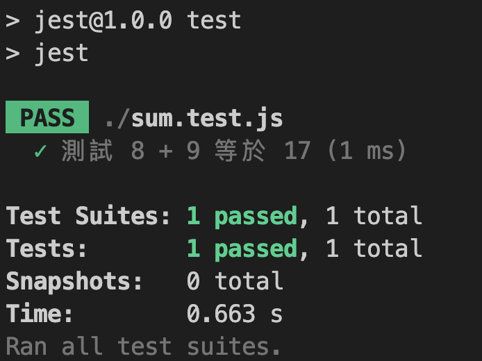

# 認識 Jest 測試框架，開始動手寫單元測試

> 如果你還在猶豫是否學習測試框架，不妨先看看筆者在[上一篇文章](./../README.md)的分享喔！

這篇文章會從建立專案開始，依序帶你了解需要設定的環境、單元測試的結構，接著帶你完成第一個單元測試。

在對單元測試有基礎的概念後，會透過實際的範例讓你了解不同匹配器（Matchers）的使用時機，話不多說，我們直接開始吧！

```
大綱

一、初始化專案、設定測試環境
二、了解單元測試的結構，撰寫程式
三、了解 Jest 常用的匹配器（Matchers）
```

### 一、初始化專案、設定測試環境

**SETP 1**：初始化專案＆安裝 Jest。

```shell
mkdir jest-practice
cd jest-practice

npm init -f

npm install jest babel-jest ts-jest @types/jest
```

**SETP 2**：進入「package.json」增加測試用 scripts。

```json
{
  ...
  "scripts": {
    "test": "jest"
  },
  ...
}
```

**SETP 3**：在根目錄下新增「jest.config.ts」。

```js
module.exports = {
  transform: {
    '^.+\\.tsx?$': 'ts-jest',
  },
  moduleFileExtensions: ['ts'],
};
```

**SETP 4**：在根目錄下新增「tsconfig.json」。
```json
{
  "compilerOptions": {
    "esModuleInterop": true,
  },
}
```

### 二、了解單元測試的結構，撰寫程式

我們就用最簡單的「加法」來做說明：`a + b = c`

如果把加法寫成單元測試，可以拆解成下面的結構：
- **測試的目標**：我們要證明 `a + b = c`。
- **要測試哪個 function**：要測試 `sum` 這個 function。
- **測試期待的結果**：確認 sum 執行 `a + b` 的結果等於 `c`。

**SETP 1**：在專案下新增兩個檔案
```shell
# 放測試的 function
touch public.ts
# 測試的腳本
touch public.test.ts
```

**SETP 2**：在 public.ts 撰寫 `sum` 這個 function，並於 public.test.ts 用測試程式來驗證他。
#### public.ts
```js
export function sum (a: number ,b: number) {
    return a + b;
}
```

#### public.test.js
```js
const { sum } = require('./public');

test('測試 8 + 9 等於 17', () => {
    expect(sum(8, 9)).toBe(17);
});
```

**SETP 3**：運行測試指令 `npm run test`
，如果順利就會看到下圖的結果：


最後我們再來回顧一下先前提到的結構：
- **測試的目標**：test(`測試 8 + 9 等於 17`, () => {});
- **要測試哪個 function**：`sum(8, 9)`
- **測試期待的結果**：expect(sum(8, 9)).toBe(`17`);

### 三、了解 Jest 常用的匹配器（Matchers）

匹配器（Matchers）是讓我們驗證執行結果是否符合預期的工具，下面筆者放上幾個常用的範例。

- **toBe**：最常用的匹配器。
```js
test('toBe 匹配器其實能取代許多 Matcher', () => {
    expect(1 + 2).toBe(3);
    expect(null).toBe(null);
    expect(null).toBeNull();
    expect(undefined).toBe(undefined);
    expect(undefined).toBeUndefined();
});
```
- **toEqual**：如果要物件（object）間的比對可以使用它。
```js
test('toEqual 主要是比對物件', () => {
    const data = { one: 1 };
    data['two'] = 2;
    expect(data).toEqual({ one: 1, two: 2 });
});
```
- **toBeCloseTo**：應用在小數點的計算。
```js
test('小數點相加', () => {
    const value = 0.1 + 0.2;
    // 有小數點的請使用 toBeCloseTo，否則會有 rounding error
    // expect(value).toBe(0.3);
    expect(value).toBeCloseTo(0.3); // This works.
});
```
- **toMatch**：字串比對。
```js
test('透過 toMatch 確認「stop」是否存在於字串', () => {
    expect('Christoph').toMatch(/stop/);
});
```
- **toContain**：確認「值」是否存在於陣列。
```js
test('toContain 會透過迭代來確認陣列是否存在某值', () => {
    const shoppingList = [
        'diapers',
        'kleenex',
        'trash bags',
        'paper towels',
        'milk',
    ];
    expect(shoppingList).toContain('milk');
});
```
- **toThrow**：確認吐出的錯誤訊息是否符合期待。
```js
test('toThrow 可以用來檢核錯誤訊息', () => {
    expect(() => doSomething()).toThrow();
    expect(() => doSomething()).toThrow(Error);
    expect(() => doSomething()).toThrow('Something wrong');
    expect(() => doSomething()).toThrow(/wrong/);
    expect(() => doSomething()).toThrow(/^Something wrong!$/);// 若要求完全相同
});
```

以上是 Jest 測試框架的入門應用，如果想更深入的了解，可以參考筆者的其他文章：
[Jest 框架進階應用（describe、Setup and Teardown、Mock function）](./../jest-advanced/README.md)